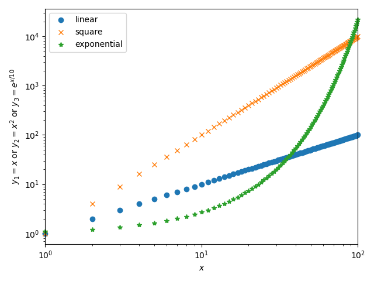

# 実験概要
## 目的

## 実験の手順

# 実験結果および考察
## パラメータ設定

  | パラメータ                 | 値 |
  |----------------------------|----|
  | 乱数の発生個数 $N$         |    |
  | 一様分布の範囲 $(a, b)$    |    |
  | 指数分布の $\lambda$       |    |
  | パレート分布の $\alpha$    |    |
  | パレート分布の最小値 $x_m$ |    |
  |----------------------------|----|

## 一様分布

 
 *図1: サンプル*
 
## 指数分布

## パレート分布

